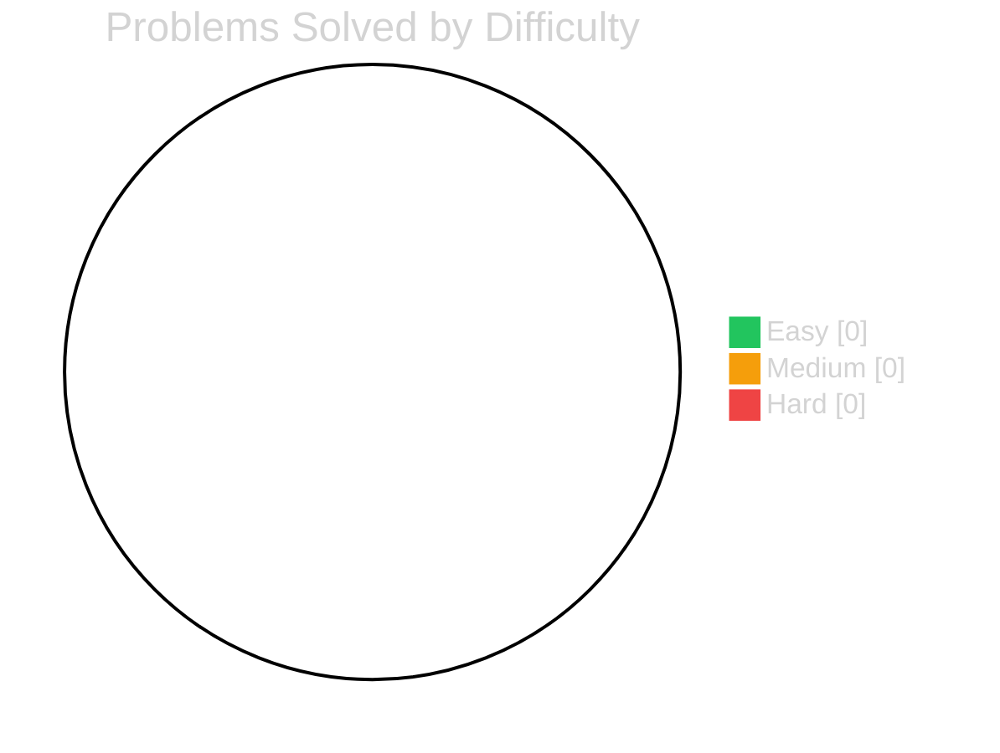
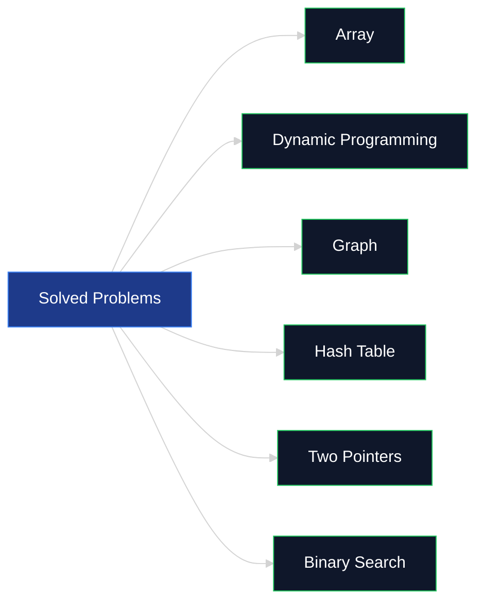

<div align="center">


<br/>

<a href="https://mohitxcode.space">
  
</a>
<a href="https://leetcode.com/u/mohitxcode/">
  
</a>
<a href="https://github.com/MohitXCode">
  
</a>

<br/><br/>


</div>

<br/>

## 📊 Live Stats

<div align="center">


</div>

<div align="center">


</div>

> **Note:** Stats above pull from public APIs and refresh automatically on every page load — no manual updates needed. LeetCode card requires a public LeetCode profile.

<br/>

## 🗂️ Repo Structure

Every solved problem auto-commits here the moment it's Accepted on LeetCode — synced via a self-hosted [MyLeetSync](#-how-this-stays-up-to-date) extension, organized **by topic**, not by date or difficulty:

```text
leetcode-solutions/
├── Array/
│   └── 0001-two-sum/
│       ├── solution.py
│       └── README.md      ← AI-generated approach + complexity notes
├── Dynamic-Programming/
│   └── 0070-climbing-stairs/
│       ├── solution.py
│       └── README.md
├── Graph/
│   └── 0200-number-of-islands/
│       ├── solution.py
│       └── README.md
├── Hash-Table/
├── Binary-Search/
├── Two-Pointers/
└── ...
```

Each problem folder's `README.md` follows the same format:

```markdown
## Problem
Plain-English restatement

## Approach
How the solution works, in a few sentences

## Complexity
- Time: O(...)
- Space: O(...)
```

<br/>

## 📈 Progress by Difficulty

<div align="center">



</div>

<sub>This chart is static — update the numbers above as you solve more, or swap it for the live LeetCode card above once your profile has volume.</sub>

<br/>

## 🏷️ Problems by Topic

<div align="center">



</div>

<br/>

## ⚙️ How This Stays Up to Date

This repo doesn't get manual commits. Solutions land here automatically through a Chrome extension I built myself — **MyLeetSync** — instead of trusting a third-party OAuth app with broad GitHub permissions:

1. Solve on LeetCode → submit → Accepted
2. Extension intercepts the verdict client-side, pulls problem metadata
3. [Groq](https://groq.com) (Llama 3.3 70B) generates the approach + complexity writeup
4. Commits `solution.<ext>` + `README.md` here, topic-sorted, via a GitHub fine-grained token scoped to **only this repo**

No standing access to any other repo. No org-wide scopes. Token expires every 90 days by design.

<br/>

## 🛠️ Tech Used Across Solutions

<div align="center">


</div>

<br/>

<div align="center">


**⭐ If this structure is useful to you, feel free to fork it for your own LeetCode journey.**

</div>
